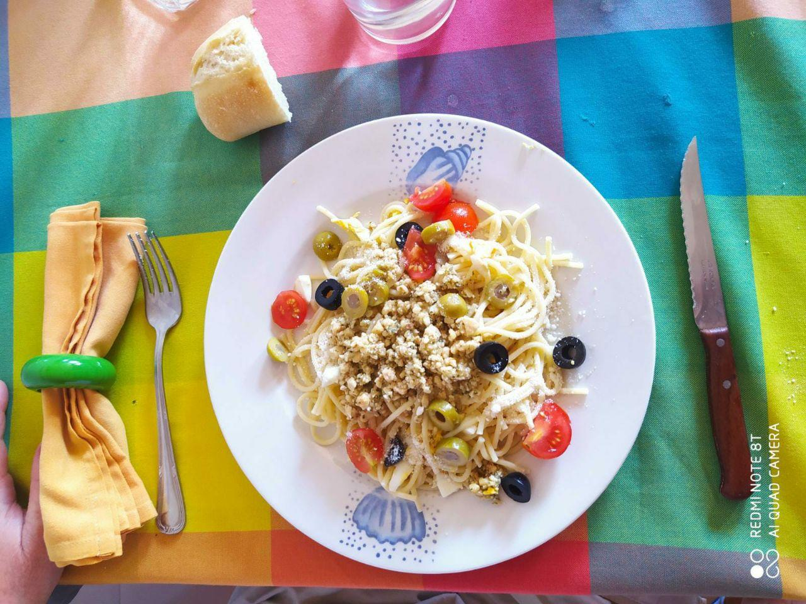

# ☑️ Macarrones con Pesto (6 personas)

## Ingredientes
- 400 g de macarrones
- 300 g de tomates cherry

Para el pesto de avellanas:
- 20 g de avellanas
- 10 g de queso en polvo
- Medio diente de ajo pelado
- 6 cucharadas soperas de aceite de oliva
- Sal y pimienta

## Preparación
1. Preparar el pesto poniendo todos los ingredientes (salvo el aceite) en el mortero y machacándolos bien.
2. Ir añadiendo el aceite poco a poco hasta obtener una salsa untuosa. También se puede mezclar con la batidora.
3. Cocer la pasta el tiempo que indique el paquete.
4. Mientras, mezclar el pesto con los tomates lavados y cortados por la mitad.
5. Una vez cocida la pasta, pasarla rápidamente por agua fría y mezclarla con el pesto y las tomates.
6. Servirlo frío.

