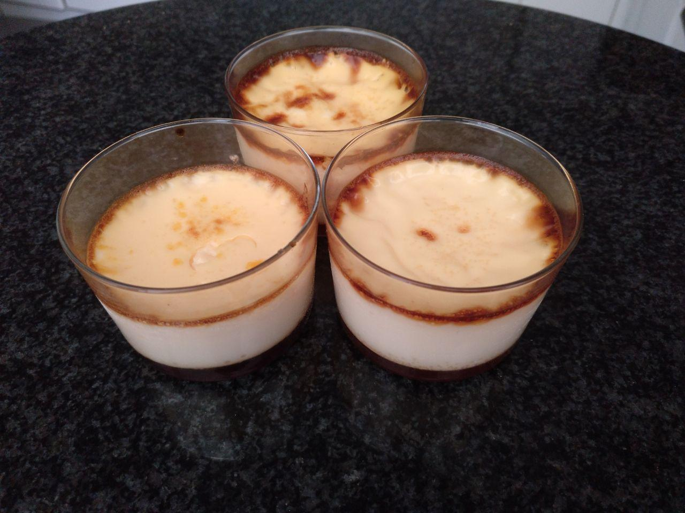

# ☑️ Flan de Huevo

## Ingredientes
- 4 huevos
- 1 bote de leche condensada
- 2 medidas de bote de leche
- (opcional: raspadura de 1 limón)

## Preparación
1. Poner un molde con caramelo y encima todo lo anterior batido
2. Opción 1: colocarlo [al baño María en la olla durante 9 minutos](https://youtu.be/4FSuHuKZ_DY)
3. Opción 2: colocar [al horno al baño María a 180ºC de temperatura durante 1 hora](https://youtu.be/kDf4WguW-gc). Tapar con albal si se quema

