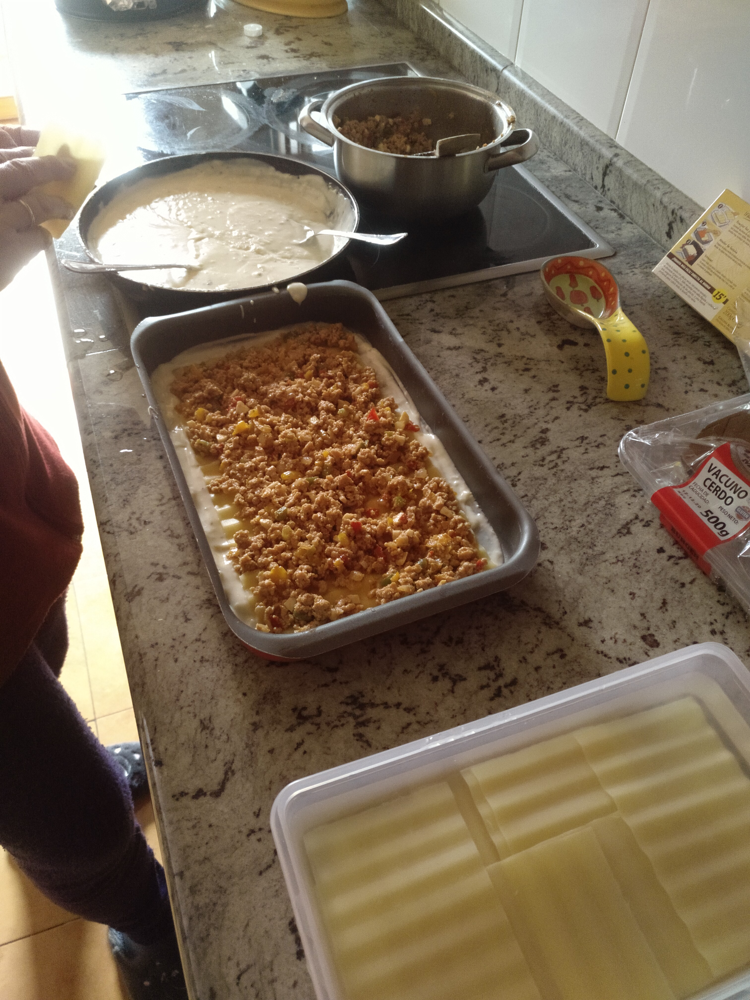

# ☑️ Lasaña (4-6 personas)

## Ingredientes
- Placas de lasaña precocidas (16)
- Carne picada (500-600 g)
- Bechamel:
    - 7 cucharadas de aceite de oliva o mantequilla
    - 7 cucharadas harina
    - 1 litro de leche
    - Sal
- Queso rayado en polvo
- 1/2 cebolla
- 2 dientes de ajo
- 1/2 pimiento verde
- 1/2 pimiento rojo
- Orégano
- Tomate
- 1 huevo cocido

## Preparación
1. Hacer un sofrito con aceite de oliva y freír la cebolla partida en trozos pequeños, el ajo y los pimientos
2. Cuando esté frito, añadir la carne picada y sofreír
3. Añadir un poco de tomate frito
4. Añadir el huevo cocido partido en trozos pequeños
Bechamel:
5. Poner en la sartén el aceite de oliva o mantequilla
6. Cuando esté templado (fuego al 5), añadir la harina y remover
7. Ir añadiendo la leche poco a poco e ir removiendo
8. Cuando se ha añadido toda la leche, dejar que dé un hervor. Poner un poco de sal
9. Mientras se hace la bechamel, poner las capas de lasaña en agua templada (remover de vez en cuando).
10. Poner en una fuente de horno:
    1. Capa de bechamel
    2. Placa de lasaña
    3. Capa de carne
    4. Placa de lasaña
    5. Capa de bechamel
    6. Placa de lasaña
    7. Capa de carne
    8. Placa de lasaña
    9. Capa de bechamel
    10. Queso rallado

11. Cocer al horno a 220ºC 10 minutos y 3-5 minutos gratinando

