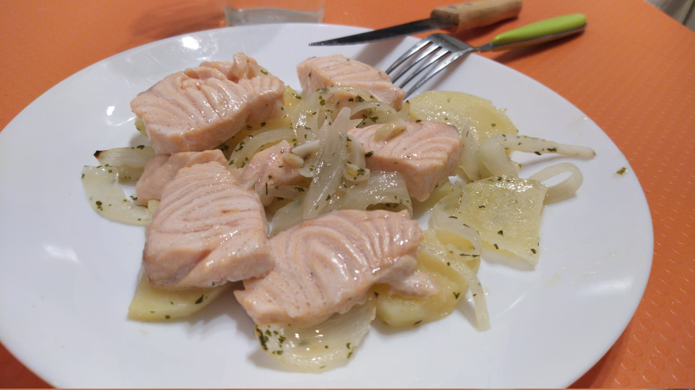

# Salmón al horno con patatas, para una persona

## Ingredientes
- Salmón fresco en un lomo
- 1 ajo
- Perejil
- 1/4 de cebolla
- Sal
- Media patata
- Agua
- Aceite de oliva

## Preparación
1. Precalentar el horno a 190ºC.
2. Cortar las patatas, la cebolla en aros y el ajo.
3. Añadir las patatas, la cebolla y el ajo.
4. Añadir medio vaso de agua y 1 cucharada y media de aceite de oliva.
5. Remover bien y adjuntar un poco de perejil y sal.
6. Meter al horno durante 20 minutos (a los 10 minutos dar la vuelta a las patatas).
7. Colocar las porciones de salmón durante 4 minutos, lo justo para cambiar de color.

